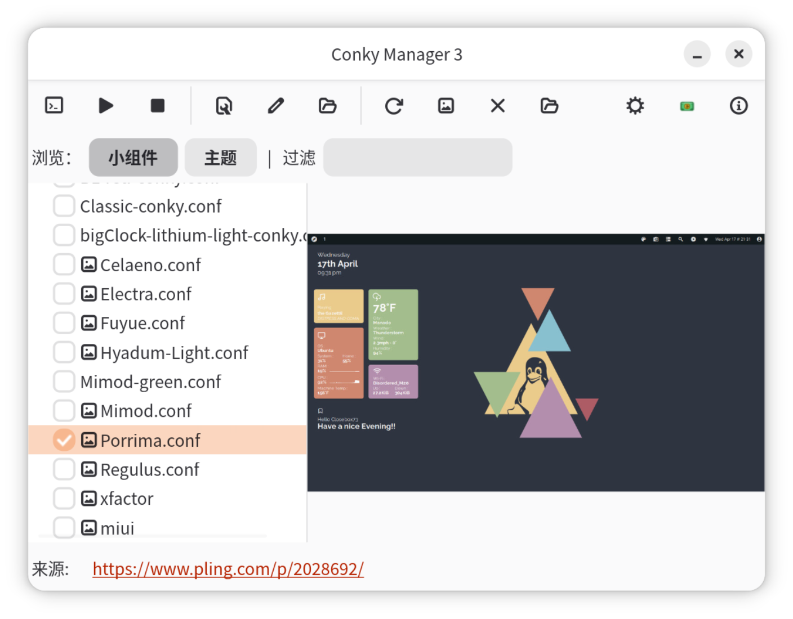

# Conky Manager 3

Conky Manager 3 is a GTK front-end for managing Conky themes and widget
configuration files. It can scan common Conky locations, start and stop
widgets, import theme packs, generate previews, and open widget configuration
files for editing.

<p align="center">
  
</p>

This project is a fork of the original Conky Manager by teejee2008
(Tony George). It keeps the same general workflow, but has been updated for
newer Conky configuration formats and modern GTK-based desktops.

## Project Status

The current development line is version 3.0. The application now builds against
GTK 4 and libadwaita with Meson, and the Debian packaging path is the primary
supported build and install workflow.

The repository currently includes:

- GTK 4/libadwaita application code written in Vala
- Meson build rules
- Debian packaging files
- AppStream metadata and a desktop launcher for software-center integration
- hicolor icon installation rules
- preview generation support for installed Conky widgets

The project is usable, but still carries legacy code from the original
application. Some GTK APIs used by the code are deprecated in newer GTK 4
versions, so builds currently produce many warnings. There are no automated
tests in the tree yet.

## Supported Systems

The current packaging and build scripts target Debian, Ubuntu, Linux Mint, and
related distributions.

Conky Manager 3 is a host-facing desktop utility. It launches Conky, reads and
writes user Conky configuration files, inspects windows, and uses desktop
tools such as ImageMagick and X11 utilities for preview generation. Because of
that, a sandboxed Flatpak package would need careful permission review and is
not the primary packaging path today.

## Runtime Dependencies

The Debian package depends on Conky and supporting command-line tools. At a
minimum, a working installation needs:

- `conky`, `conky-all`, or `conky-std`
- `p7zip-full`
- `rsync`
- `imagemagick`
- `libglib2.0-bin`
- `x11-utils`

## Build Dependencies

Install the build dependencies on Debian or Ubuntu with:

```bash
sudo apt install build-essential git debhelper-compat dpkg-dev meson ninja-build valac \
  libgee-0.8-dev libgtk-4-dev libadwaita-1-dev libjson-glib-dev \
  gettext libgettextpo-dev
```

More detailed build notes are in [HOWTOBUILD.md](./HOWTOBUILD.md).

## Build

Clone the repository and build it with Meson:

```bash
git clone https://github.com/zcot/conky-manager3.git
cd conky-manager3
meson setup builddir
meson compile -C builddir
```

To install from a Meson build:

```bash
sudo meson install -C builddir
```

## Build a Debian Package

The recommended local install path is to build a Debian package:

```bash
./build-deb.sh
```

The generated `.deb`, `.changes`, and `.buildinfo` files are written to
`../builds`.

To build and reinstall the package locally:

```bash
./build-install.sh
```

## Software Center Metadata

The project installs:

- `org.conkymanager3.ConkyManager.desktop`
- `org.conkymanager3.ConkyManager.metainfo.xml`
- `org.conkymanager3.ConkyManager.png` hicolor icons

This is enough for Debian/Ubuntu repositories that export AppStream metadata
to show the application in GNOME Software and similar software centers. See
[docs/gnome-software-packaging.md](./docs/gnome-software-packaging.md) for
the current packaging notes and validation commands.

## Removed Legacy Paths

The old direct Makefile build, Autotools template files, and ad-hoc installer
script have been removed. Use Meson or the Debian package scripts for current
development.
